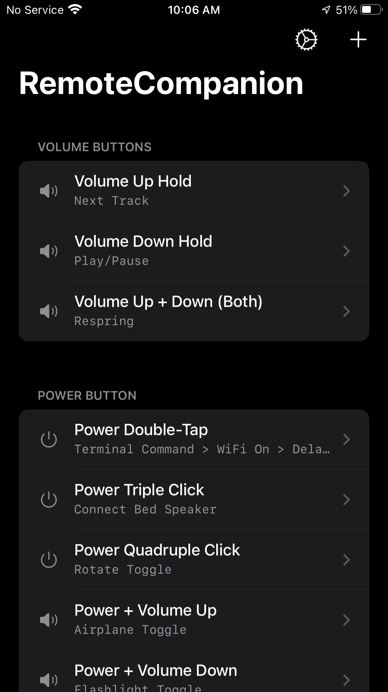
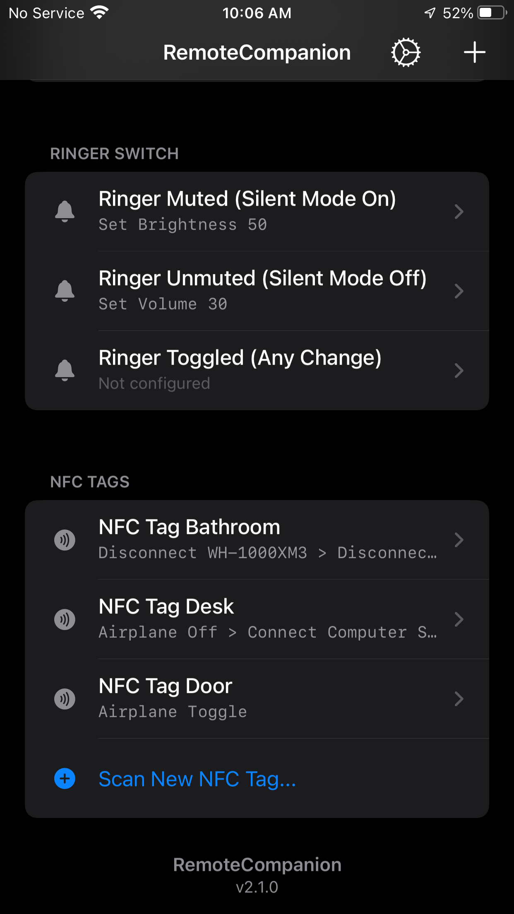
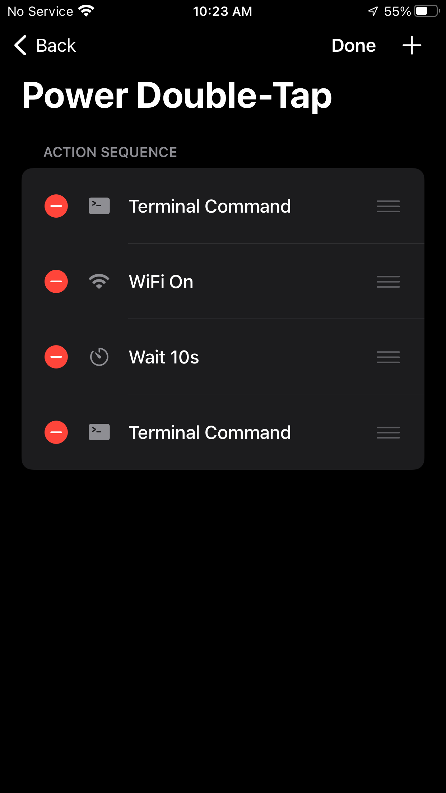
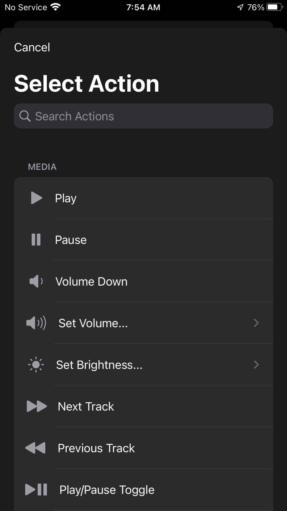
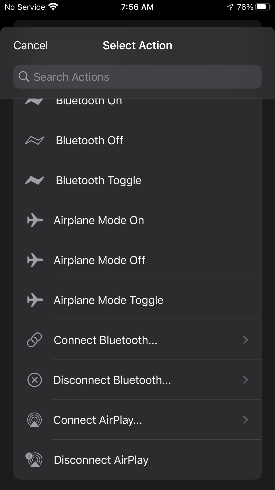
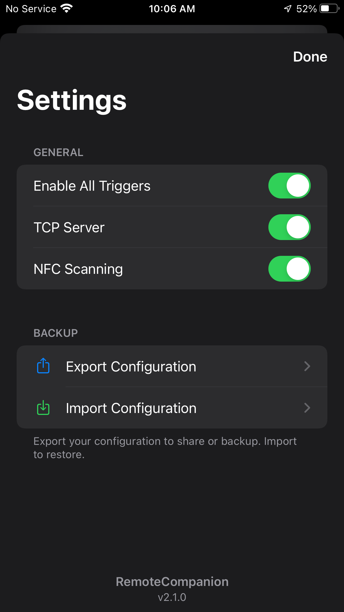

# RemoteCompanion

RemoteCompanion brings fast, scriptable system control to modern rootless jailbreaks. It lets you bind physical gestures and hardware buttons to system actions, media controls, and custom scripts.

> [!IMPORTANT]
> **What's New in v2.1**
> - **iOS 14 & Rootful Support**: Broader compatibility covering legacy firmware and rootful jailbreak environments.
> - **Unified Device Pickers**: Discovery-based, searchable live lists for nearby AirPlay and Bluetooth hardware.
> - **Action Editing**: Modify any existing action in your sequence by simply tapping it.
> - **Port Change & Speed**: Default TCP port moved to `12340` with optimized local probes for instant (~0.25s) execution.
> - **iPad Experience**: Official support for iPads with full landscape orientation and optimized layouts.
> - **Home Button**: Native simulation of the Home button for all device models (physical and gesture-based).
> - **Modern Code Editor**: Completely redesigned, edge-to-edge UI with iOS 17 aesthetics.
> - **True Multitasking**: Concurrent server handling powered by GCD—zero battery drain, zero blocking.

<p align="center">
  
  
  
</p>
<p align="center">
  
  
  
</p>

## Features
- **Instant Response**: Actions execute in milliseconds using a optimized, dependency-free architecture.
- **Smart Control**: Run multi-step action sequences, open apps, or control settings remotely.
- **Hardware Triggers**: Bind actions to Power/Volume buttons, Home button, Touch ID (Tap/Hold), or the Ringer Switch.
- **Visual Excellence**: Modern iOS aesthetics with Large Titles, SF Symbols, and frosted glass effects.
- **Universal Search**: Instantly find actions, shortcuts, and devices with integrated search bars in every picker.
- **Native Experience**: Redesigned edge-to-edge Terminal and Lua editors with full iPad landscape support.
- **Advanced Automation**: Full support for NFC tags, custom scripts, and Siri integration.
- **Live Discovery**: Real-time management and connection for nearby AirPlay and Bluetooth hardware.

## What you can do

### Media & Volume
- `rc play` / `rc pause` / `rc playpause` / `rc next` / `rc prev`
- `rc volume 0-100` - Set volume.
- `rc volume` - Get current volume percentage.
- `rc mute [on|off|toggle|status]` - Control media mute state.
- `rc anc [on|off|transparency]` - Control headphone ANC (requires Sonitus).

### Device Control
- `rc lock` / `rc lock toggle` / `rc lock status`
- `rc unlock <pin>` - Wakes and unlocks the device.
- `rc button [power|lock|home|volup|voldown|mute]` - Simulate physical buttons.
- `rc brightness 0-100` - Set screen brightness.
- `rc flashlight [on|off|toggle]` - Control the torch.
- `rc rotate [lock|unlock|toggle|status]` - Orientation lock control.
- `rc dnd [on|off|toggle]` - Toggle Do Not Disturb.
- `rc low power mode [on|off|toggle]` - Toggle battery saver.
- `rc airplane [on|off|toggle]` - Control Airplane Mode.
- `rc haptic` / `rc screenshot`

### Apps & Shortcuts
- `rc open <alias|bundleID>` (e.g., `youtube`, `spotify`, `settings`, `messages`, `home`, `photos`, `camera`, `clock`, `maps`, `calendar`, `weather`, `notes`, `reminders`, `appstore`, `mail`, `music`, `phone`, `stocks`, `calculator`, `tv`, `wallet`, `facetime`, `files`).
- `rc kill <alias|bundleID>` - Force close an app.
- `rc app` - Get current foreground app's bundle ID.
- `rc shortcut -r "Name" [-p "Input"]` - Run any Shortcut (requires SpringCuts).
- `rc url "https://google.com"` - Open any link (with smart unlock).
- `rc spotify <playlist|album|artist> <id>` - Play specific Spotify content.
- `rc spotify play` - Resume Spotify playback.

### Connectivity
- `rc wifi [on|off|toggle]` / `rc bluetooth [on|off|toggle]`
- `rc bluetooth [connect|disconnect] <name>` - Manage paired devices.
- `rc airplay list` - See speakers and their UIDs.
- `rc airplay connect <UID|Name>` / `rc airplay disconnect`

### Hardware Triggers (Tweak App)
Configure these in the `RemoteCompanion` app for custom action sequences. Tip: **Long-press** any trigger in the app to instantly test and run its assigned actions.
- **Hardware Buttons**:
  - **Power**: Double-tap, Long-press, **Triple/Quadruple click**, or **Power + Volume Up/Down** combos.
  - **Volume**: Long hold Up/Down (0.3s) or **Volume Up + Down** combo.
  - **Home**: Double-tap (Touch ID), Double, Triple, or Quadruple click.
- **Touch ID Sensor**: **Single Tap** and **Hold (Rest Finger)** triggers.
- **NFC Triggers**: Scan physical NFC tags to run actions on screen wake (Optional toggle in Settings).
- **Ringer Switch**: Mute, Unmute, or Toggle triggers.
- **Gestures**: 
  - **Status Bar**: Hold (Left/Center/Right) or Swipe Left/Right.
  - **Edge Gestures**: Vertical swipe on left/right edges.

### Text & Notifications
- `rc type "Text"` - Type text (supports symbols).
- `rc paste "Text"` - Paste into clipboard.
- `rc key <hex>` - Specific keyboard keys (e.g., `0x04` for 'A', `0x28` for Enter).
- `rc notify -t "Title" -m "Msg" [-p priority]` - Send push notifications (via ntfy). Priority: `min`, `low`, `default`, `high`, `urgent`.

### System & Diagnostics
- `rc respring` - Restart SpringBoard.
- `rc is-locked` - Check if device contains a passcode lock and is currently locked.

## Getting Started

### 1. Requirements
- A **Jailbroken Device** (iOS 14+). Supports both Rootless (iOS 15+) and Rootful (iOS 14) environments.
- The `RemoteCompanion` tweak installed.

### 2. Installation Options

#### Option 1: Repository (Recommended)
Add `https://saihgupr.github.io/RemoteCompanion` to Zebra, or use `zbra://sources/add/https://saihgupr.github.io/RemoteCompanion`

#### Option 2: Manual Install
Download the `.deb` from [Releases](https://github.com/saihgupr/RemoteCompanion/releases).

#### Option 3: Build from Source
`cd Tweak && make package install`.

### 3. Usage Options
Choose the control method that best fits your needs:

#### Option 1: TCP Server (Fastest)
Control your iPhone from your computer terminal using the `rc` script.

> [!NOTE]
> This method is **faster** than SSH because it avoids the encryption handshake overhead. Recommended for low-latency triggers. **Requires "TCP Server" enabled in app settings.**

1. Copy the script to your path:
   ```bash
   chmod +x rc
   sudo cp rc /usr/local/bin/rc
   ```
2. Set your iPhone's IP (add this to your `~/.zshrc`):
   ```bash
   export RC_IPHONE_IP=192.168.1.10
   ```
3. Run the command:
   ```bash
   rc play
   ```

#### Option 2: SSH Direct (Secure)
Control the device directly via SSH using the `rc` command installed on the iPhone.
This method works even if the external "TCP Server" is disabled in settings.

```bash
ssh mobile@iphone.local "rc lock"
ssh mobile@iphone.local "rc volume 50"
ssh mobile@iphone.local "rc respring"
```

#### Option 3: Shortcuts (via Powercuts)
Actions can even be fired from shortcuts using Powercuts.

1. Add the **Run shell command** action.
2. Enter your command:
   ```bash
   rc open Music
   rc volume 50
   ```

## Home Assistant Setup

Add this to your `configuration.yaml`:
```yaml
shell_command:
  iphone_remote: >
    bash -c 'echo '\''{{ cmd }}'\'' > /dev/tcp/YOUR_IPHONE_IP/12340'
```
Then call it with:

```yaml
service: shell_command.iphone_remote
data:
  cmd: 'play'
```
## Troubleshooting

### Apple Pay Issues
If you experience the "Updating Cards" screen or other conflicts with Apple Pay when waking your device, you can disable the background NFC scanning feature.
1. Go to the **Settings** tab (gear icon).
2. Toggle off **NFC Scanning**.

This ensures the tweak does not attempt to access the NFC controller on wake, resolving conflicts with system services.

## Support & Feedback

If you encounter any issues or have feature requests, please [open an issue](https://github.com/saihgupr/RemoteCompanion/issues) on GitHub.

If you like this project, consider giving it a star ⭐ or making a small donation.