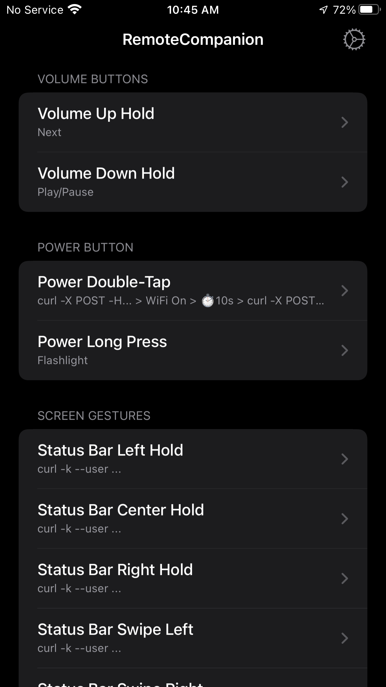
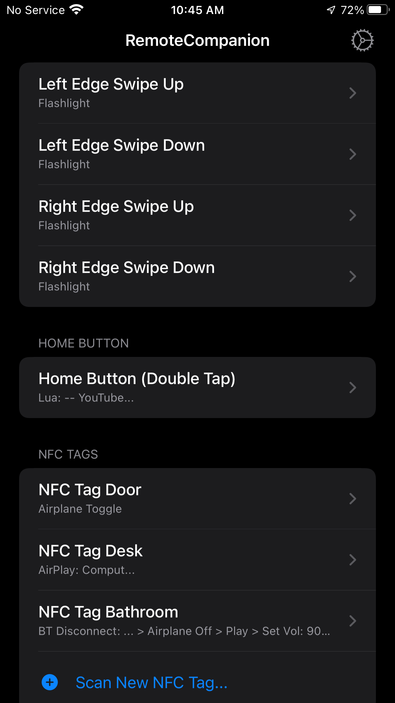
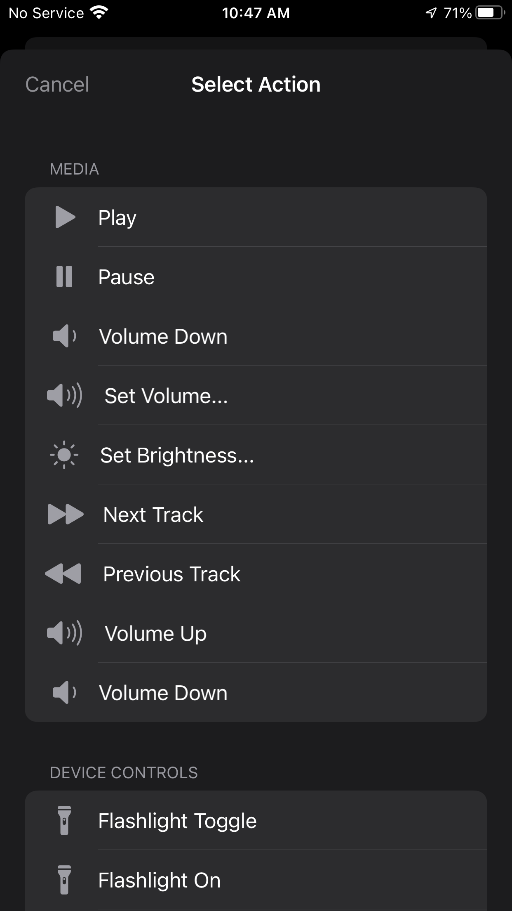
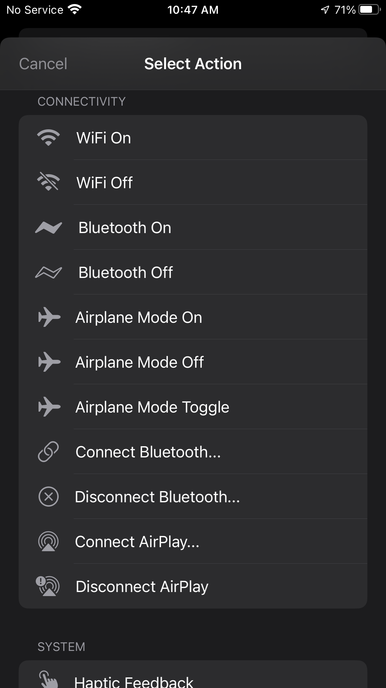
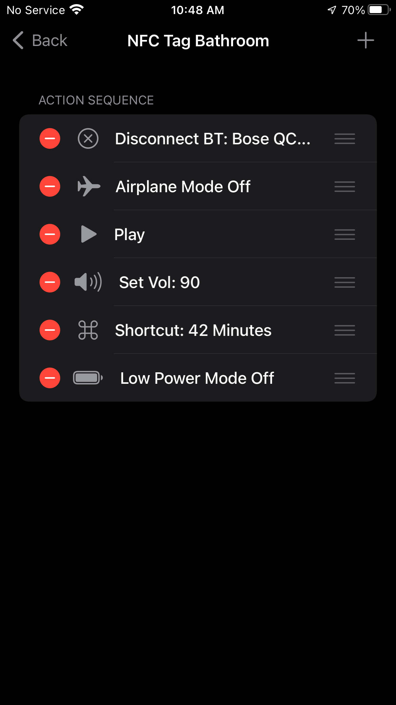
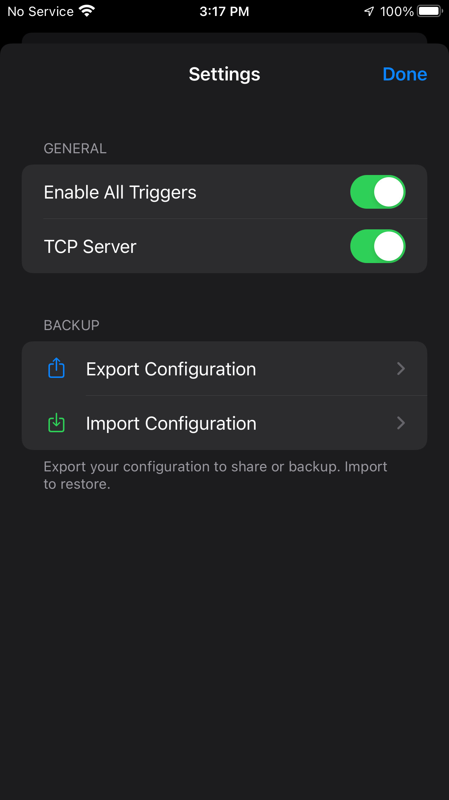

# RemoteCompanion

Control your jailbroken iPhone from anywhere. RemoteCompanion triggers media, apps, and system actions from your computer or directly from the RemoteCompanion app.

<p align="center">
  
  
  
</p>
<p align="center">
  
  
  
</p>

## Features
- **Lightning Fast**: Actions happen in milliseconds.
- **Smart Control**: Run actions, open apps, or control settings remotely.
- **Custom Triggers**: Use the companion app to assign action sequences to gestures, physical buttons, or NFC tags.

## What you can do

### Media & Volume
- `rc play` / `rc pause` / `rc playpause` / `rc next` / `rc prev`
- `rc volume 0-100` - Set volume.
- `rc volume` - Get current volume percentage.
- `rc mute [on|off|status]` - Control media mute state.
- `rc anc [on|off|transparency]` - Control headphone ANC (requires Sonitus).

### Device Control
- `rc lock` / `rc lock toggle` / `rc lock status`
- `rc unlock <pin>` - Wakes and unlocks the device.
- `rc button [power|lock|home|volup|voldown|mute]` - Simulate physical buttons.
- `rc brightness 0-100` - Set screen brightness.
- `rc flashlight [on|off|toggle]` - Control the torch.
- `rc rotate [lock|unlock|status]` - Orientation lock control.
- `rc dnd [on|off]` - Toggle Do Not Disturb.
- `rc low power mode [on|off]` - Toggle battery saver.
- `rc airplane [on|off|toggle]` - Control Airplane Mode.
- `rc haptic` / `rc screenshot`

### Apps & Shortcuts
- `rc open <alias|bundleID>` (e.g., `youtube`, `spotify`, `settings`, `messages`, `home`, `photos`, `camera`, `clock`, `maps`, `calendar`, `weather`, `notes`, `reminders`, `appstore`, `mail`, `music`, `phone`, `stocks`, `calculator`, `tv`, `wallet`, `facetime`, `files`).
- `rc kill <alias|bundleID>` - Force close an app.
- `rc app` - Get current foreground app's bundle ID.
- `rc shortcut -r "Name" [-p "Input"]` - Run any Shortcut (requires SpringCuts).
- `rc url "https://google.com"` - Open any link (with smart unlock).
- `rc spotify <playlist|album|artist> <id>` - Play specific Spotify content.
- `rc spotify play` - Resume Spotify playback.

### Connectivity
- `rc wifi [on|off]` / `rc bluetooth [on|off]`
- `rc bluetooth [connect|disconnect] <name>` - Manage paired devices.
- `rc airplay list` - See speakers and their UIDs.
- `rc airplay connect <UID|Name>` / `rc airplay disconnect`

### Hardware Triggers (Tweak App)
Configure these in the `RemoteCompanion` app for custom action sequences. Tip: **Long-press** any trigger in the app to instantly test and run its assigned actions.
- **NFC Triggers**: Scan physical NFC tags to run actions. Automatically scans for tags briefly when the screen wakes.
- **Volume Buttons**: Long hold Up/Down (0.3s).
- **Power Button**: Double-tap or Long-press.
- **Status Bar**: Hold (Left/Center/Right) or Swipe Left/Right (80pt+).
- **Edge Gestures**: Vertical swipe on left/right edges (within 50pt).
- **Home Button**: Double-tap (Touch ID). Requires "Reachability" enabled.

### Text & Notifications
- `rc type "Text"` - Type text (supports symbols).
- `rc paste "Text"` - Paste into clipboard.
- `rc key <hex>` - Specific keyboard keys (e.g., `0x04` for 'A', `0x28` for Enter).
- `rc notify -t "Title" -m "Msg" [-p priority]` - Send push notifications (via ntfy). Priority: `min`, `low`, `default`, `high`, `urgent`.

### System & Diagnostics
- `rc respring` - Restart SpringBoard.
- `rc is-locked` - Check if device contains a passcode lock and is currently locked.

## Getting Started

### 1. Requirements
- A **Rootless Jailbroken Device** (iOS 15+)
- The `RemoteCompanion` tweak installed.

### 2. Installation Options
- **Repository (Recommended)**: Add `https://saihgupr.github.io/RemoteCompanion` to Zebra, or tap [Add Repo](zbra://sources/add/https://saihgupr.github.io/RemoteCompanion) to add it automatically.
- **Manual Install**: Download the `.deb` from [Releases](https://github.com/saihgupr/RemoteCompanion/releases).
- **Build from Source**: `cd Tweak && make package install`.

### 3. Usage Options
Choose the control method that best fits your needs:

#### Option 1: TCP Server (Fastest)
Control your iPhone from your computer terminal using the `rc` script.

> [!NOTE]
> This method is **faster** than SSH because it avoids the encryption handshake overhead. Recommended for low-latency triggers. **Requires "TCP Server" enabled in app settings.**

1. Copy the script to your path:
   ```bash
   chmod +x rc
   sudo cp rc /usr/local/bin/rc
   ```
2. Set your iPhone's IP (add this to your `~/.zshrc`):
   ```bash
   export RC_IPHONE_IP=192.168.1.10
   ```
3. Run the command:
   ```bash
   rc play
   ```

#### Option 2: SSH Direct (Secure)
Control the device directly via SSH using the `rc` command installed on the iPhone.
This method works even if the external "TCP Server" is disabled in settings.

```bash
ssh mobile@iphone.local "rc lock"
ssh mobile@iphone.local "rc volume 50"
ssh mobile@iphone.local "rc respring"
```

## Home Assistant Setup

Add this to your `configuration.yaml`:
```yaml
shell_command:
  iphone_remote: 'echo -n "{{ cmd }}" | nc -w 1 YOUR_IPHONE_IP 1234'
```
Then call it with:

```yaml
service: shell_command.iphone_remote
data:
  cmd: 'play'
```

## Support & Feedback

If you encounter any issues or have feature requests, please [open an issue](https://github.com/saihgupr/RemoteCompanion/issues) on GitHub.

If you find this project useful, please consider giving it a **star**, or [buy me a coffee](https://ko-fi.com/saihgupr) if you'd like!