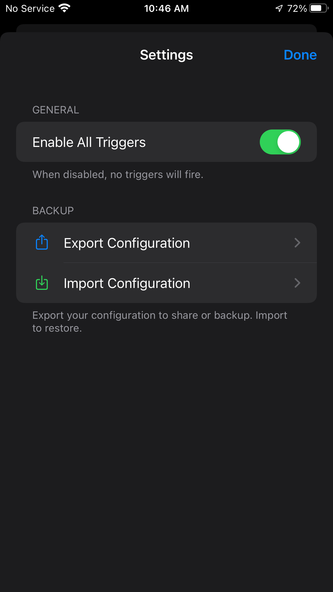

# RemoteCompanion

Control your jailbroken iPhone instantly from your computer or automation system. RemoteCompanion lets you trigger media, apps, and system actions without ever picking up your phone.

<p align="center">
  
  
  
</p>
<p align="center">
  
  
  
</p>

---

## Features
- **Lightning Fast**: Actions happen in milliseconds.
- **Smart Control**: Run Shortcuts, open apps, or control settings remotely.
- **Automation Ready**: Perfectly integrates with automation systems (like Home Assistant).
- **Safe & Stable**: Built to prevent crashes and keep your device running smooth.

---

## Getting Started

### 1. Requirements
- A **Jailbroken iPhone** (iOS 15+)
- The `RemoteCompanion` tweak installed.

### 2. Setup (CLI)
For the easiest experience on your computer, install the `rc` command:
```bash
# This makes 'rc' available from anywhere in your terminal
sudo cp /usr/local/bin/rc /usr/local/bin/
```

Configure your iPhone's IP address:
```bash
export RC_IPHONE_IP=192.168.1.10  # Change to your iPhone's IP
```

---

## What you can do

### Media & Volume
Manage your music and sound level.
- `rc play` / `rc pause` / `rc playpause`
- `rc next` / `rc prev`
- `rc volume 50` (Set to 50%)
- `rc mute on` / `rc mute off`

### Device Control
Standard iPhone actions from your computer.
- `rc lock` / `rc unlock 1234`
- `rc button power` / `rc button home`
- `rc brightness 75`
- `rc screenshot`
- `rc haptic` (Trigger a vibration)

### Apps & Shortcuts
Launch anything instantly.
- `rc open spotify` / `rc open youtube`
- `rc kill settings` (Close an app)
- `rc shortcut "Morning Routine"` (Run any iOS Shortcut)
- `rc url "https://google.com"` (Open any link)

### Connectivity
Toggle your radios and AirPlay.
- `rc wifi on` / `rc wifi off`
- `rc bluetooth on` / `rc bluetooth off`
- `rc airplay list` (See available speakers)
- `rc airplay connect "Living Room"`

### Text & Notifications
- `rc type "Hello World"` (Types text on your iPhone)
- `rc notify -t "Alert" -m "Your coffee is ready!"` (Send a push notification)

---

## Example: Home Assistant Setup

Integrating with Home Assistant is simple. Add this to your `configuration.yaml`:

```yaml
shell_command:
  iphone_remote: 'echo -n "{{ cmd }}" | nc -w 1 YOUR_IPHONE_IP 1234'
```

**To use it in an automation:**
```yaml
service: shell_command.iphone_remote
data:
  cmd: 'play'
```

---

## Support & Feedback

If you encounter any issues or have feature requests, please [open an issue](https://github.com/saihgupr/RemoteCompanion/issues) on GitHub.

If you find this project useful, please consider giving it a **star**, or [buy me a coffee](https://ko-fi.com/saihgupr) if you'd like!
